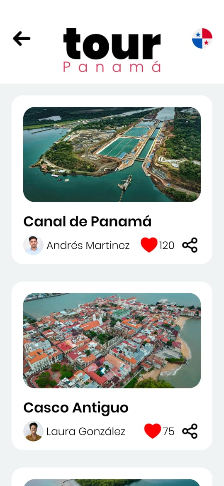
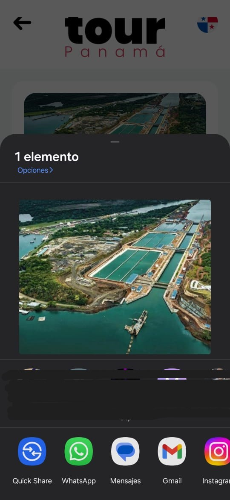
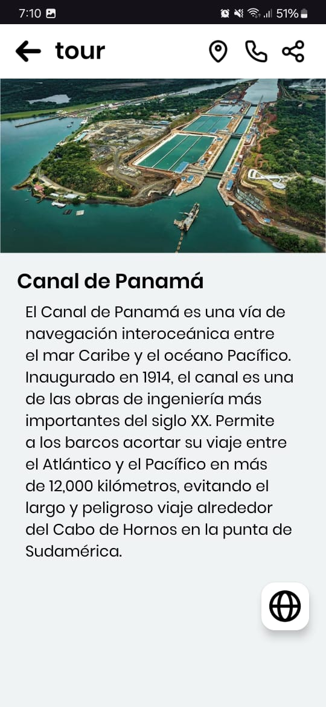
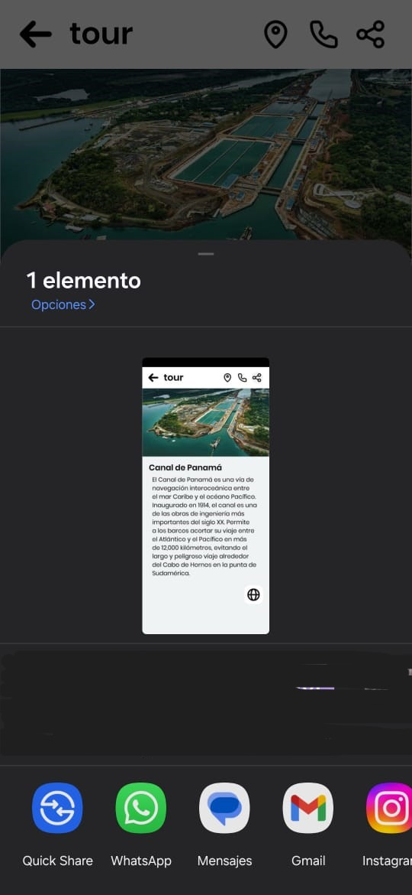
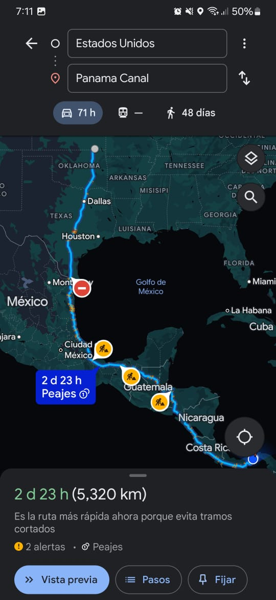

# University team project - Panama Tourist Guide Project

Design a guide application for tourist places of your choice. You must comply with the following points:

• It must have a main activity where at least 10 tourist places in Panama are shown.
• Clicking on the place must take me to another activity where an image of the place, information in text, and must have buttons that take us to:

1. Call the location by phone.
2. How to get to the place from my current point (using navigation with Google Maps).
3. A button that takes us to the website or video of the place.
4. A button to share the photo of the place with WhatsApp contacts.

## Locations screen

  

## By clicking the share button

  

## When selecting a location

  

## By clicking the share button inside of location

  

## By clicking the maps button inside of location

  

